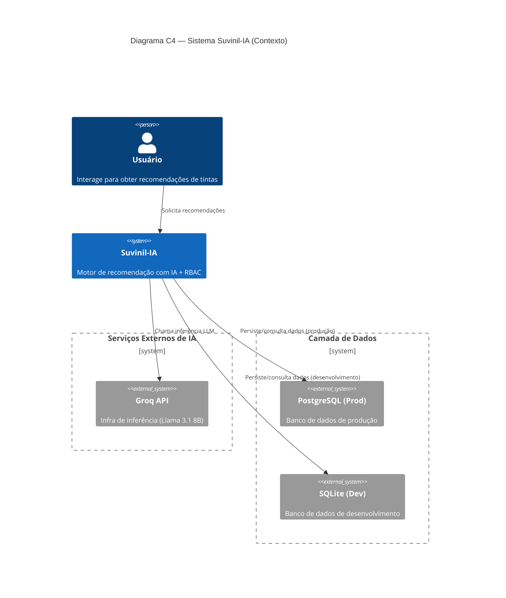
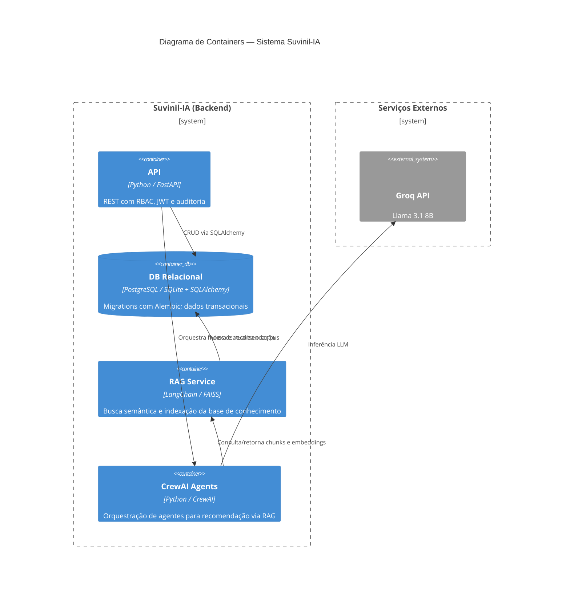
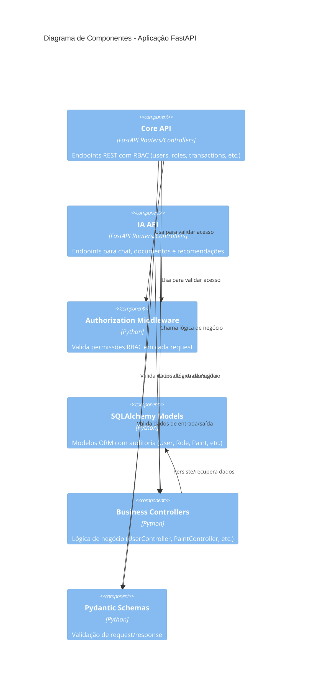

# Diagrama C4 — Suvinil-IA

Este arquivo contém os blocos principais do Diagrama C4 do projeto Suvinil-IA em formato legível (para renderização com ferramentas de MD/PlantUML/Diagrama C4 simplificado).

## Contexto

Descrição rápida:

- Usuário: solicita recomendações de tintas.
- Suvinil-IA: motor de recomendação que combina RBAC, persistência e módulos de IA.
- Serviços externos: infraestrutura de inferência (Groq API) e bases de dados (Postgres/SQLite).

Diagrama (C4 Context)

## Containers

Visão de containers principais que compõem o backend:

## Componentes

Principais componentes da aplicação FastAPI:

## Legenda e convenções

- Nomes de tabelas: lowercase (ex.: `user`, `paint`).
- Colunas audit*: prefixadas com `audit_` e preenchidas automaticamente pelo `AbstractBaseModel`.
- Padrão de arquitetura: Router → Controller → Model → DB.
- Dependências comuns: `DbSession = Annotated[Session, Depends(get_session)]`, `CurrentUser = Annotated[User, Depends(get_current_user)]`.

## Como renderizar

Este arquivo está escrito para ser compatível com ferramentas que entendem sintaxe C4/PlantUML embutida em Markdown. Para gerar imagens/diagramas, você pode usar:

- PlantUML + C4 plugin (com suporte a blocos `C4Context`, `C4Container`, `C4Component`).
- Extensões VS Code que renderizam PlantUML/Markdown com diagramas.

Exemplo rápido com PlantUML:

1. Salve este bloco (apenas a seção do diagrama) em um arquivo `.puml`.
2. Execute uma ferramenta que converta PlantUML para PNG/SVG (ex.: extensão PlantUML do VS Code ou plantuml.jar).

## Notas finais

 - Este documento é de alto nível; detalhes das implementações (arquivo/rotas/nomes) ficam no código-fonte em `apps/core/` e `apps/ia/`.
 - Mantenha os diagramas sincronizados com alterações arquiteturais importantes.
